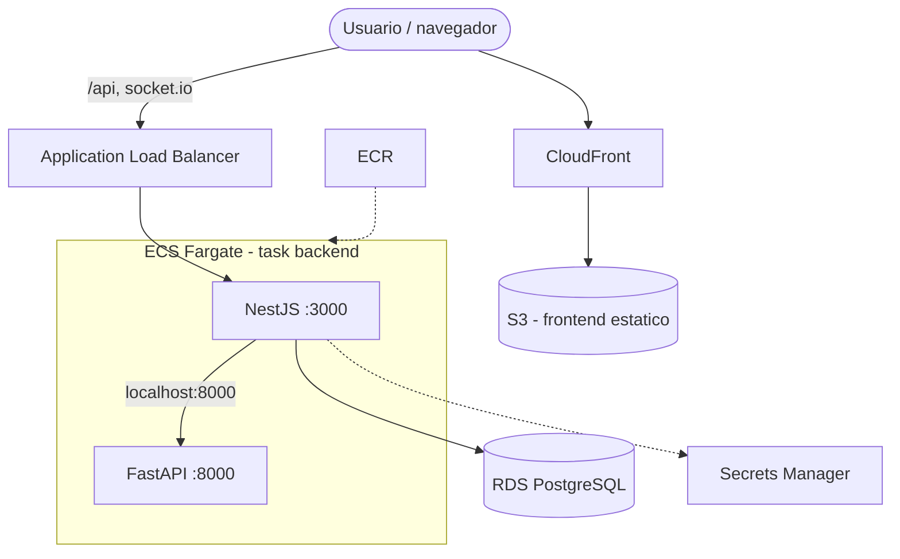

# Arquitectura AWS (mínima para demo)

Objetivo: correr IntersectIA en AWS con el mínimo de servicios, costo bajo y buenas prácticas de seguridad, para una demostración de taller universitario. No está pensada para datos reales ni tráfico masivo.

## Decisión de cómputo

- **Frontend estático**: Next.js ya se exporta con `output: 'export'`, así que se sirve como archivos estáticos desde **S3** detrás de **CloudFront** con **Origin Access Control** (bucket privado). No necesita servidor.
- **Backend + AI**: son procesos de larga duración con **WebSocket** (socket.io) y estado en memoria por sesión. Lambda no encaja (timeout de 15 min, conexiones persistentes, cold starts). Se usa **ECS Fargate**.
- **Base de datos**: PostgreSQL relacional con Prisma → **RDS**.

## Diagrama de contenedores

## Componentes

| Servicio | Uso | Notas |
|---|---|---|
| S3 + CloudFront | Frontend estático | OAC, bucket privado, caché de `/_next/static` |
| ALB | Entrada HTTP/WS | Enruta a ECS; habilita sticky sessions si se escala |
| ECS Fargate | Backend + AI | Dos contenedores en la misma task (AI por `localhost`) |
| ECR | Imágenes | Tags inmutables por commit SHA |
| RDS PostgreSQL | Persistencia | `db.t4g.micro`, single-AZ, subred privada |
| Secrets Manager | Secretos | `INTERNAL_SERVICE_TOKEN` y credenciales de DB |
| CloudWatch | Logs | Driver `awslogs` |

## Por qué backend y AI en la misma task

El backend llama a la IA en la ruta crítica con presupuesto de **150 ms**. Ponerlos en la misma task de Fargate (misma red) hace que la llamada sea `http://localhost:8000` (sin costo de red entre servicios) y elimina service discovery. La IA nunca se expone al ALB.

## Red

- VPC con subredes públicas (ALB) y privadas (ECS, RDS).
- ECS en subred privada con salida a Internet mediante **NAT Gateway** (para descargar de ECR/Secrets/CloudWatch). Alternativa sin NAT: VPC Endpoints (más trabajo).
- El security group de RDS solo acepta el puerto 5432 desde el security group de ECS.

## Alternativa de costo casi cero (solo VM)

Para una demo corta, una sola **EC2 `t3.small`** (o Lightsail) con el `docker-compose.yml` de este repo corre todo (Postgres incluido) sin ALB ni RDS. Menos servicios gestionados y menos buenas prácticas, pero mucho más barato y simple. Ver `docs/despliegue.md`.

## Extensiones futuras (no incluidas)

- HTTPS con ACM + dominio propio; ALB en 443.
- Multi-AZ en RDS y ECS.
- CloudWatch alarms, dashboards y tracing (X-Ray).
- Auto-scaling de ECS por CPU y migración de Terraform a backend remoto con state locking.
- Vector store gestionado (S3 Vectors u OpenSearch) si el chatbot escala a RAG con embeddings de Bedrock.
